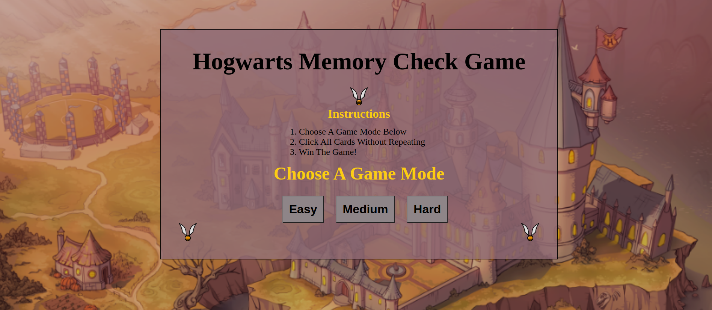
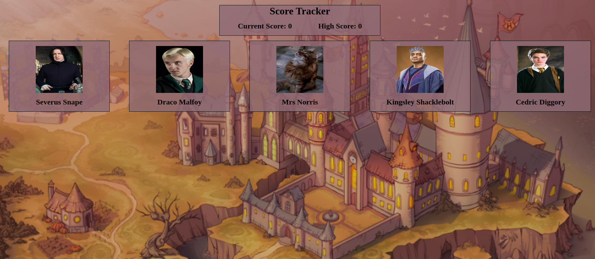
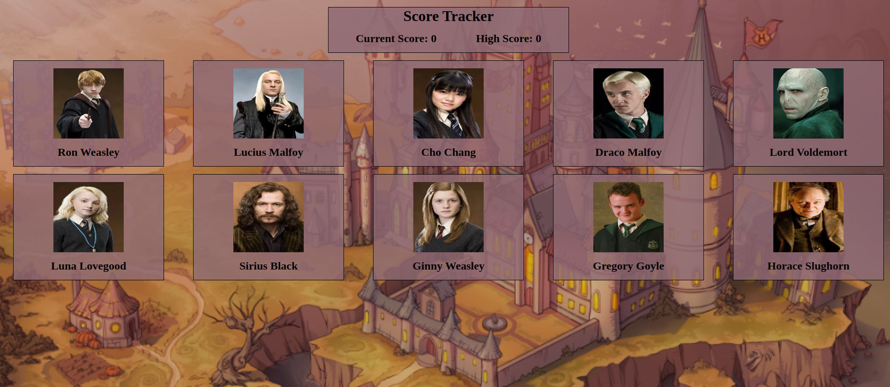
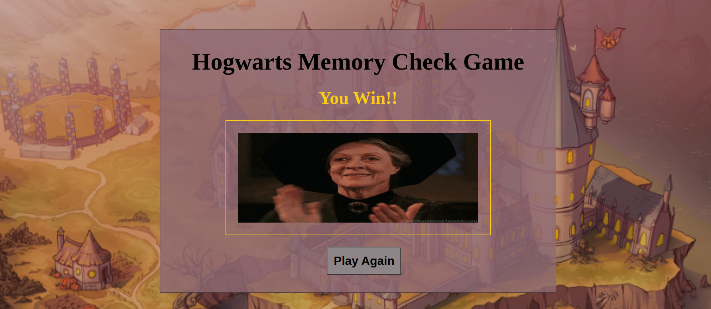

# Hogwarts Memory Check Game

**Objective**

I created a memory check game in React using JSX and CSS. I used Netify to deploy the app. I also used Vite and Axios when writing this project.

***Images***

Loading Page:

Instructions Page:

Easy Mode Page:

Medium Mode Page:

Hard Mode Page:

Winner Page:

***Features***

1. The loading page features a short gif that runs while the API is loading. It runs longer than the API so the gif finishes using a setTimeout function.

2. The instructions page has text instructions and three game mode buttons. The buttons will populate a different number of memory cards, easy mode has five, medium mode has ten, and hard mode has fifteen cards.

3. The game page has a score board that shows current score and high score. If a player clicks a card twice their current score will be reset to zero and their high score will log their highest score in that game mode attempt this play through.

4. The winner page will show when the max score per level difficulty has been achieved. The winner page also has a play again button that will port the user back to the instructions page when they can pick a game mode and play again.

***Credits***

1. Background Image: https://wallpapercrafter.com/

2. API: https://hp-api.onrender.com/

3. Gifs: https://giphy.com/

4. Icons: https://www.iconfinder.com/

